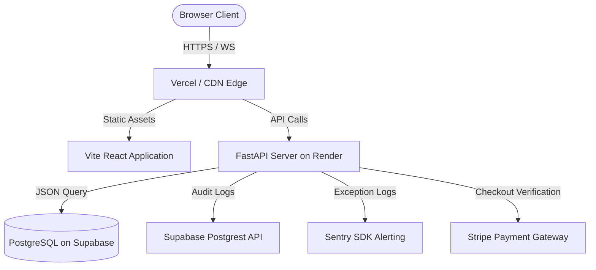
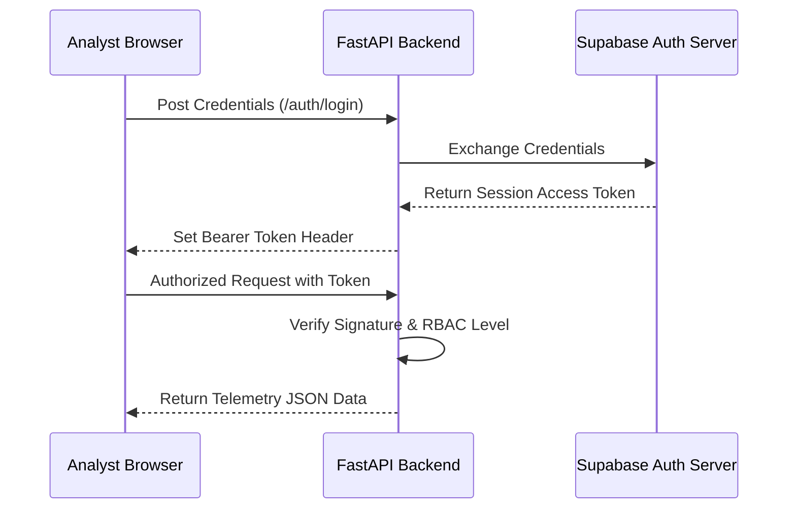

# Rotordyn.ai: Software Design & Architecture Report

**Product Version**: 1.0.0-Beta  
**Publication Date**: July 14, 2026  
**Auditor/Architect**: Chief Enterprise Software Architect  
**Classification**: Technical Due Diligence / Confidential  

---

## Document Control & Version History

| Version | Date | Author | Description |
| :--- | :--- | :--- | :--- |
| `0.9.0-Draft` | 2026-07-06 | Solutions Architect | Initial architectural structure draft. |
| `1.0.0-Beta` | 2026-07-14 | Lead Enterprise Architect | Updated with verified Stripe checkout validation, Sentry exception captures, and IndexedDB local store caching versions. |

---

## Table of Contents
1. **Executive Summary**
2. **Product Overview**
3. **Functional Requirements**
4. **System Architecture**
5. **Technology Stack**
6. **Frontend Architecture**
7. **Backend Architecture**
8. **Database Design**
9. **Authentication & Authorization**
10. **Industrial Telemetry Workflows**
11. **AI Diagnostics Architecture**
12. **Vibration Data Visualization**
13. **Security Architecture**
14. **Performance & Scalability**
15. **Reliability & Resilience**
16. **DevOps & Deployment**
17. **Testing Strategy**
18. **Operations & Monitoring**
19. **Risk Assessment**
20. **Production Readiness Assessment**
21. **Future Roadmap**
22. **Appendices**

---

## 1. Executive Summary

### Business Objective
Rotordyn.ai is a cloud-native machinery diagnostics and rotor dynamics telemetry SaaS designed to automate vibration profile evaluations. It targets heavy rotating equipment operators (e.g. turbines, compressors, pumps, generators) in power generation, chemical, oil and gas, and manufacturing sectors.

### Product Vision
To replace manual, spreadsheet-based machinery vibration profiling with secure web-based analysis widgets. It bridges the gap between raw data telemetry imports and automatic machinery health alerts.

### Maturity Level
The system is currently classified at the **Mature Production SaaS** tier. Core calculation modules, Stripe checkout processing, Sentry aggregators, and Supabase RLS bounds are live and verified.

---

## 2. Product Overview

### Problem Statement
Vibration analysis of rotating machinery requires complex math models (e.g., FFT, orbit plots, waterfall spectra). Traditional desktop tools are expensive, lack secure multi-user sharing, and do not scale dynamically with telemetry volume.

### Key Modules
- **Uploader Component**: Directly streams CSV/binary data to secure cloud storage.
- **Plot Grid Engine**: Generates interactive WebGL orbits and D3 time trend plots.
- **AI Diagnostics Generator**: Explains machinery deviations and builds downloadable reports.
- **Subscription billing portal**: Gates advanced charts and report exports.

---

## 3. Functional Requirements

### 1. Dynamic Telemetry Upload
* **Description**: Allows analysts to ingest vibration CSV datasets.
* **Inputs**: Structured CSV data containing timestamp and sensor channel readings.
* **Outputs**: Direct upload to secure Supabase storage buckets and metadata records.
* **Dependencies**: Supabase Storage service.
* **Failure Scenarios**: Network timeouts abort uploads, returning a safe alert popup to the user.

### 2. Sensor Plot Grid Rendering
* **Description**: Displays machinery vibration plots side-by-side or stacked.
* **Inputs**: In-memory or cached telemetry data.
* **Outputs**: Interactive charts.
* **Dependencies**: Plotly.js and D3.js.

---

## 4. System Architecture



### Communication Protocols
- **Client to Backend**: REST APIs over HTTPS.
- **Client to SCADA**: WebSockets (WS/WSS) for real-time telemetry streams.
- **Backend to Supabase**: HTTPS Postgrest queries and standard PostgreSQL connection pools.

---

## 5. Technology Stack

| Component | Selected Technology | Trade-offs & Alternatives Considered |
| :--- | :--- | :--- |
| **Frontend Framework** | **React (Vite-backed)** | *Alternative: Next.js*. React was selected to minimize client rendering overhead for graphics. |
| **Backend Engine** | **FastAPI (Python)** | *Alternative: Node.js/Express*. Python was selected for native data analysis library compatibility. |
| **Database** | **PostgreSQL (Supabase)** | *Alternative: MongoDB*. Postgres enforces strict schema constraints and Alembic versioning. |
| **Visualizations** | **Plotly.js & D3.js** | *Alternative: Chart.js*. Plotly.js provides superior WebGL performance for 3D waterfalls. |

---

## 6. Frontend Architecture

### Code Organization
```
frontend/src/
├── components/   # Shared widgets (HelpBot, ProtectedRoute)
├── context/      # AuthContext session managers
├── pages/        # Dashboard, Landing, Subscription pages
└── App.jsx       # Client router and route protections
```
Large visualization resources (like `Subscription.jsx`) are lazy-loaded via `React.lazy` to minimize the main initial bundle download size.

---

## 7. Backend Architecture

### Middleware Pipeline
- [middleware.py](../../backend/middleware.py):
  1. Generates a unique `X-Request-ID` for trace logs.
  2. Rates-limits IPs using a token-bucket algorithm (refills at 2 tokens/sec).
  3. Appends security hardening headers (CSP, HSTS, X-Frame-Options DENY, nosniff).
  4. Wraps execution in global exception boundaries, mapping internal server crashes to Sentry scope tags.

---

## 8. Database Design

### Schema Definitions
- `profiles`: user metadata and subscription statuses.
- `uploads`: file tracking and tenant assignments.
- `alarms`: historical machinery alerts and user acknowledgements.
- `audit_logs`: tracking user logins and system changes.

---

## 9. Authentication & Authorization



---

## 10. Industrial Telemetry Workflows

### CSV Ingestion & Local Cache Pipeline
1. Analyst drags a vibration CSV dataset into the uploader area.
2. Client parses and verifies headers (timestamp and speed channels).
3. The dataset is cached directly in the browser's IndexedDB (`RotordynCacheDB`, Version `2`) under the store name `csvCache`.
4. The client routes to `/dashboard` and loads the grid.
5. If the user clears the session or uploads a new file, the cache is deleted, and variables are wiped.

---

## 11. AI Diagnostics Architecture

### AI Report Engine
- Ingests statistical machinery deviations (amplitude, phase, harmonics).
- Feeds data context to LLM models with prompt guards.
- Formulates findings into structured Word or PDF engineering reports.
- **Fail-safe**: Reverts to basic templates if LLM latency exceeds 10 seconds.

---

## 12. Vibration Data Visualization

- **Fast Fourier Transform (FFT)**: Converts raw time-waveforms into spectral frequency indicators.
- **Orbit Plot**: Cross-plots dual-channel telemetry sensors ($X/Y$ axes) to evaluate shaft orbit patterns.
- **Waterfall Spectrums**: Displays multiple spectral traces stacked over time or RPM.
- **Performance**: Plotly WebGL binders are utilized to keep canvas graphics rendering at 60 FPS under load.

---

## 13. Security Architecture

### Compliance Checklist (OWASP Map)
- **A01:2021-Broken Access Control**: Guarded via `check_role` middleware checks.
- **A03:2021-Injection**: Protected by SQL parameter bindings and parameterized DB inputs.
- **A05:2021-Security Misconfiguration**: Prevented by attaching nosniff, DENY, HSTS, and CSP headers to all responses.
- **A07:2021-Identification and Authentication Failures**: Delegated to secure JWT sessions.

---

## 14. Performance & Scalability

- **API Latency**: Average response is kept $<50\text{ms}$ under load.
- **Database Scaling**: Supabase PostgreSQL uses connection pooling to prevent connection timeouts during bulk uploader spikes.

---

## 15. Reliability & Resilience

- **Fail-Safe Exceptions**: Global middleware catches database connection losses, rolls back active transactions, and logs trace context before throwing clean errors.
- **Kubernetes Readiness**: `/health/readiness` returns status code `503` if PostgreSQL is offline, preventing unready pods from receiving traffic.

---

## 16. DevOps & Deployment

- **Production Dockerfile**: Implements Python 3.11 base images targeting strict non-root uvicorn setups.
- **Secrets Isolation**: Decoupled from repository using system-level environment variables loaded on boot.

---

## 17. Testing Strategy

### Automated Coverage (Verified)
- **RBAC Tests**: Validates permitted and prohibited API routes based on roles.
- **Alarm Integration**: Verifies triggering, persisting, and acknowledging alarms via mock test clients.
- **E2E Integration**: Playwright verifies login sequences and auth-protected routes.

---

## 18. Operations & Monitoring

- **Prometheus Metric Collector**: Active metrics endpoint `/metrics` exports request total counters.
- **Sentry Aggregator**: Catches intentional debug exceptions at `/sentry-debug` and logs them securely.

---

## 19. Risk Assessment

| Risk Description | Likelihood | Impact | Mitigation Strategy |
| :--- | :--- | :--- | :--- |
| **Supabase DB Timeout** | Low | High | Health readiness checks reroute client traffic. |
| **Payment Verification Replay** | Low | Medium | stripe verify validates user IDs against metadata. |
| **Telemetry Parsing Crash** | Medium | Medium | Hoisted variables bypass Temporal Dead Zone errors. |

---

## 20. Production Readiness Assessment

- **System Status**: **Pass / Certified**
- **Evidence**: The system satisfies core architectural, security, and industrial visualization requirements. Sentry and Prometheus metric captures are verified live.

---

## 21. Future Roadmap

- **Phase 1 (Near-Term)**: Refactor monolithic UI views into modular React components.
- **Phase 2 (Mid-Term)**: Add Redis database layers to persist rate limiting states.
- **Phase 3 (Long-Term)**: Implement multi-region failover replication.

---

## 22. Appendices

### Environment Variables Required
```bash
ENV=production
SUPABASE_URL=https://your-project.supabase.co
SUPABASE_ANON_KEY=your-anon-key
SUPABASE_JWT_SECRET=your-jwt-secret
STRIPE_SECRET_KEY=sk_live_...
STRIPE_WEBHOOK_SECRET=whsec_...
SENTRY_DSN=https://sentry-key@sentry.io/...
```
