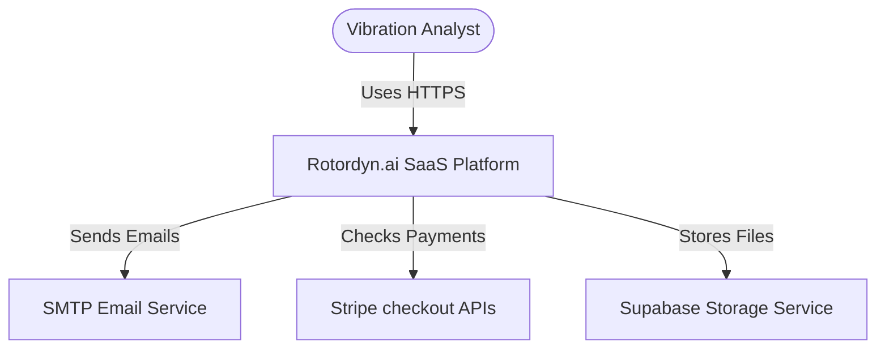
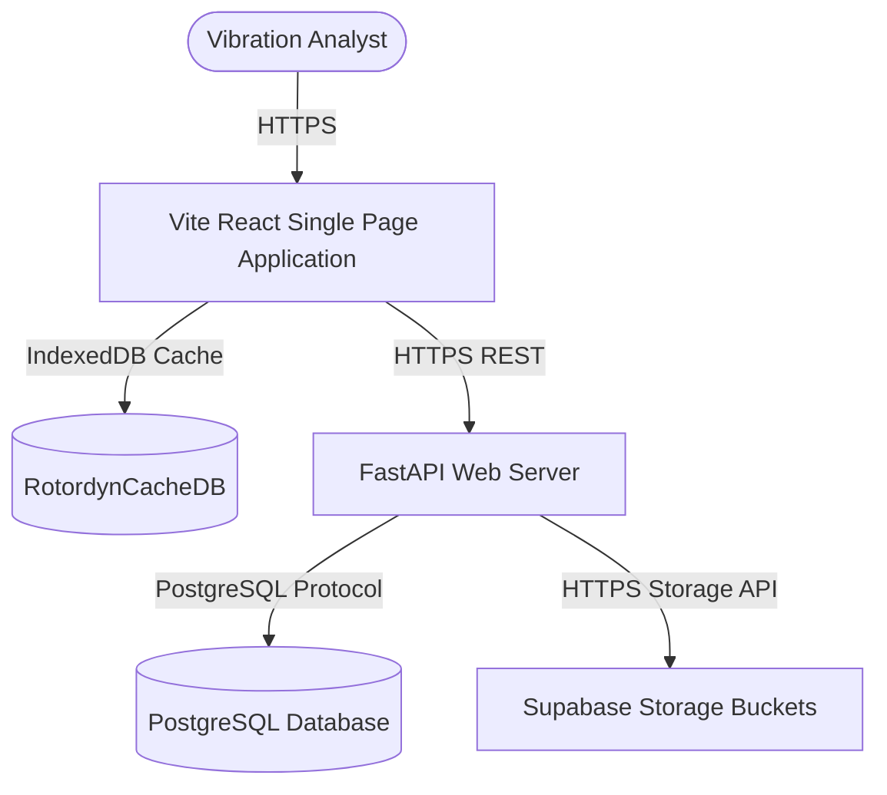

# Rotordyn.ai: Software Architecture Document (SAD)

**Document Reference**: ROTORDYN-SAD-1.0.0  
**Version**: 1.0.0-Beta  
**Date**: July 14, 2026  
**Author**: Solutions Architecture Group  
**Classification**: Enterprise Confidential  

---

## Document Control

### Revision History

| Version | Date | Author | Description |
| :--- | :--- | :--- | :--- |
| `0.9.0` | 2026-07-06 | Solutions Architect | Initial C4 architecture mapping and technology stack definitions. |
| `1.0.0` | 2026-07-14 | Solutions Architect | Updated with edge security configurations, CORS subnet exceptions, and database migrations. |

---

## 1. C4 Architecture Model

### 1.1 Context Diagram (Level 1)

### 1.2 Container Diagram (Level 2)

---

## 2. Deployment Architecture

The application is deployed across multi-cloud environments to maximize availability:
1. **Frontend Edge Network**: The static React client bundle is deployed on Vercel CDN. Edges enforce secure response headers (HSTS, CSP, X-Frame-Options DENY).
2. **Backend API Cluster**: The FastAPI python application runs inside Docker containers hosted on Render.
3. **Database Layer**: The PostgreSQL instance is hosted on Supabase and implements Row-Level Security (RLS) policies scoped by user identifiers.

---

## 3. Data Flow & Sequence Diagrams

### 3.1 Telemetry Diagnostics Data Flow
1. **Ingest Phase**: Analyst loads a CSV telemetry file. The browser parses it on a non-blocking thread.
2. **Local Caching**: The file is stored in `RotordynCacheDB` (IndexedDB) to prevent network latency.
3. **API Logging**: Telemetry metadata is uploaded to `/uploads` endpoint on FastAPI.
4. **Interactive Processing**: The client renders dynamic Plotly WebGL orbit charts, cross-referencing user filter controls.

---

## 4. Architectural Trade-offs & Decisions

### 4.1 FastAPI vs. Express.js
FastAPI was selected over Node.js because the core diagnostics application requires Python-native scientific packages (numpy, pandas) to calculate fast fourier transforms and centerline orbits.

### 4.2 Local Caching (IndexedDB) vs. Server Caching (Redis)
To minimize backend bandwidth costs and server execution spikes, raw CSV telemetry is cached directly inside the browser's IndexedDB. Server-level caching is reserved for tenant alerts database records.
