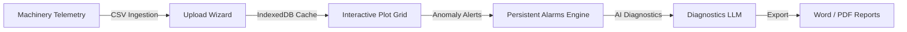
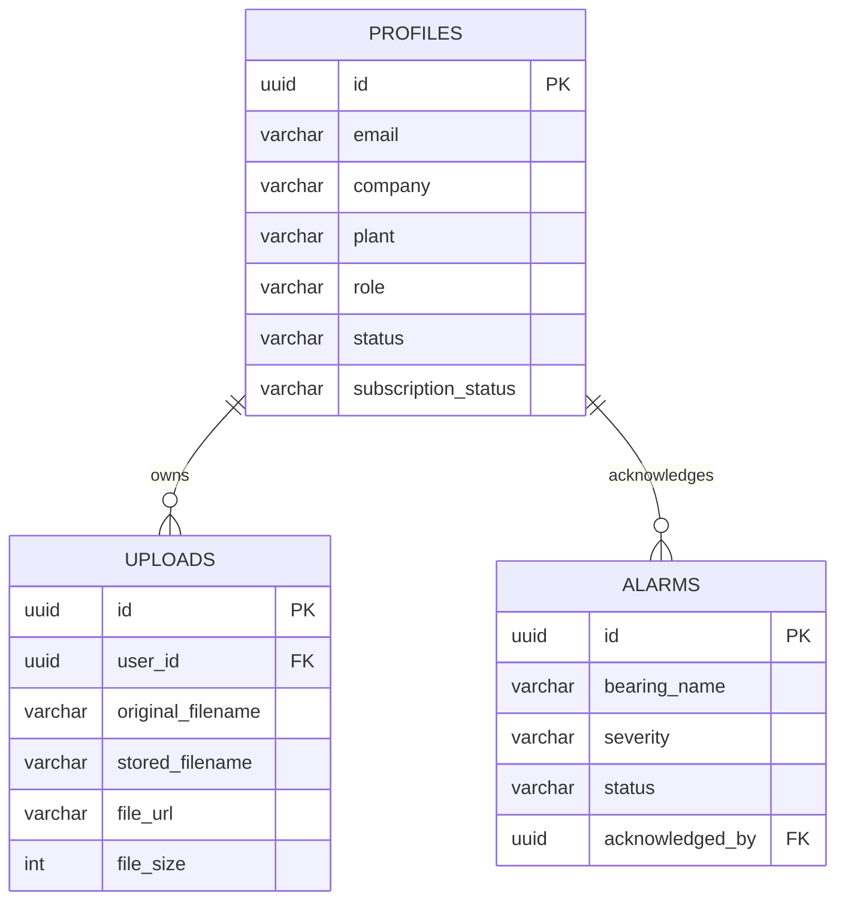

# Rotordyn.ai: Software Design Document (SDD)

**Document Reference**: ROTORDYN-SDD-1.0.0  
**Version**: 1.0.0-Beta  
**Date**: July 14, 2026  
**Author**: Solutions Architecture Group  
**Classification**: Enterprise Confidential  

---

## Document Control

### Revision History

| Version | Date | Author | Description |
| :--- | :--- | :--- | :--- |
| `0.9.0` | 2026-07-06 | Solutions Architect | Initial design blueprint and functional boundaries specification. |
| `1.0.0` | 2026-07-14 | Solutions Architect | Updated with verified Stripe checkouts, Sentry error mappings, and global state variables hoisting. |

---

## 1. Executive Summary

### 1.1 Business Objective
Rotordyn.ai provides automated rotor dynamics analysis and machinery vibration diagnostics as a secure, multi-tenant SaaS. The platform processes high-frequency rotating equipment telemetry data and generates explainable engineering diagnostics.

### 1.2 Target Users
- **Vibration Analysts**: Review historical trend plots, FFT spectrums, and orbit trajectories.
- **Maintenance Managers**: Monitor active machinery alerts, check sensor diagnostics, and generate shift audit trails.
- **Enterprise System Administrators**: Audit workspace teams, manage user roles, and adjust subscription billing parameters.

---

## 2. Business Context & Functional Requirements

### 2.1 Functional Requirements Matrix

| Ref ID | Description | Input | Output | Dependencies |
| :--- | :--- | :--- | :--- | :--- |
| **FR-01** | Telemetry File Ingestion | Drag-and-drop CSV file | Local IndexedDB stream | HTML5 Drag & Drop API |
| **FR-02** | Local Client Caching | Parsed CSV rows | IndexedDB database | `RotordynCacheDB` (Version 2) |
| **FR-03** | Plot Grid Visualization | Filtered dataset parameters | Plotly WebGL orbit charts | Plotly.js / D3.js |
| **FR-04** | Live SCADA Emulation | WebSocket metrics stream | Real-time chart refreshes | WebSocket connection |
| **FR-05** | Persistent Alarm Logging | Threshold violations | Postgres alarm entries | Supabase Postgres DB |
| **FR-06** | AI Reports Generation | Telemetry anomaly data | PDF / Word report exports | Supabase edge keys / Stripe billing gates |

---

## 3. Non-Functional Requirements (NFR)

### 3.1 Security & Access Control
- All request parameters must pass through token authentication validation checks.
- Sensitive payment flows must verify signatures against Stripe webhook verification keys.
- Client browsers must receive CSP, HSTS, DENY, and nosniff headers on every response.

### 3.2 Performance & UI Responsiveness
- High-frequency plots must render at 60 FPS using GPU-backed WebGL.
- Parsing 50,000 telemetry rows must not block the main browser threat (caching and rendering offloaded to async loops).

---

## 4. Architecture & Component Design

### 4.1 System Overview
Rotordyn.ai implements a decoupled client-server architecture:
1. **Frontend**: Vite-backed React SPA deployed on Vercel Edge.
2. **Backend**: FastAPI web server running Python 3.11 on Render instances.
3. **Database**: PostgreSQL hosted on Supabase, leveraging Row-Level Security (RLS) policies.

### 4.2 Component Blueprint
- [Dashboard.jsx](../../frontend/src/pages/Dashboard.jsx): Contains the main interface logic. Hoists telemetry state variables globally to prevent Temporal Dead Zone (TDZ) reference errors during render cycles.
- [middleware.py](../../backend/middleware.py): Intercepts server API requests to enforce rate-limiting bucket rules, inject UUID request IDs, and configure CSP protections.
- [routes/auth.py](../../backend/routes/auth.py): Controls PKCE callbacks, user registrations, token session checks, and Stripe checkout verification.

---

## 5. Database Design

### 5.1 Tables & Relationships

---

## 6. API Design & Security Middleware

### 6.1 Critical Middleware Enforcements
All HTTP API endpoints are wrapped by the `SecurityAndLoggingMiddleware` class in [middleware.py](../../backend/middleware.py#L39-L171):
- Enforces security response headers.
- Captures unhandled backend exceptions and logs trace contexts to stderr.
- Configures Sentry SDK error dispatching parameters dynamically.
