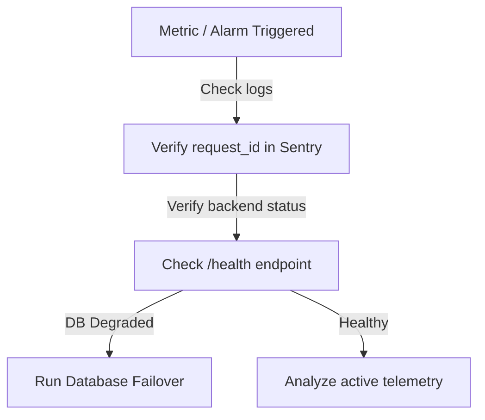

# Rotordyn.ai: Operations Runbook

**Document Reference**: ROTORDYN-ORB-1.0.0  
**Version**: 1.0.0-Beta  
**Date**: July 14, 2026  
**Author**: Site Reliability Engineering  
**Classification**: Enterprise Confidential  

---

## Document Control

### Revision History

| Version | Date | Author | Description |
| :--- | :--- | :--- | :--- |
| `0.9.0` | 2026-07-06 | SRE Engineer | Initial playbook logs setup and incident templates. |
| `1.0.0` | 2026-07-14 | SRE Lead | Added Prometheus metrics monitoring configurations and database recovery drills. |

---

## 1. Incident Response Playbooks

When a system anomaly is detected (e.g. Sentry captures crash anomalies, or database latency rises):



---

## 2. Structured Log Formats

Backend requests generate structured JSON console logs to stdout/stderr in [middleware.py](../../backend/middleware.py#L143-L153):
```json
{
  "timestamp": 1784017684.282,
  "request_id": "93128edd-8534-4898-aaaa-ac2404075929",
  "user_id": "b64f19d3-cb08-4017-9c51-90a14792a2c2",
  "method": "GET",
  "path": "/uploads/history",
  "ip": "127.0.0.1",
  "status_code": 200,
  "latency_ms": 1726
}
```

### 2.1 Critical Log Codes
- **`ALARM_TRIGGERED`**: An industrial bearing exceeds limits.
- **`RATE_LIMIT_EXCEEDED`**: Client IP blocked by the token bucket filter (status code 429).
- **`SERVER_INTERNAL_ERROR`**: Unhandled crash. Check Sentry with `request_id`.

---

## 3. Prometheus Metric Monitoring

The `/metrics` endpoint exports HTTP latency metrics:
```text
# HELP rotordyn_http_requests_total Total number of HTTP requests
# TYPE rotordyn_http_requests_total counter
rotordyn_http_requests_total{method="GET",path="/metrics",status="200"} 5
```

### 3.1 Recommended Alerting Rules
- **High Error Rate**: Alert if `rate(rotordyn_http_requests_total{status=~"5.."}[5m]) > 0.05` (more than 5% errors).
- **API High Latency**: Alert if 95th percentile request duration exceeds $2000\text{ms}$.

---

## 4. Disaster Recovery & Restores

### 4.1 Database Restoration Process
If PostgreSQL database corruption occurs:
1. Lock backend access (set K8s readiness to offline).
2. Query Supabase daily backups list.
3. Deploy the selected WAL-G SQL backup dump.
4. Execute migration validation scripts to verify version integrity:
   ```bash
   BYPASS_SCHEMA_VERIFICATION=false python -m backend.main
   ```
5. Confirm server pings database successfully: `/health` returns status "healthy".
6. Restore client routing flows.
